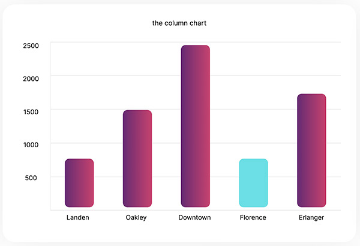
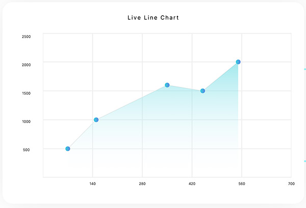
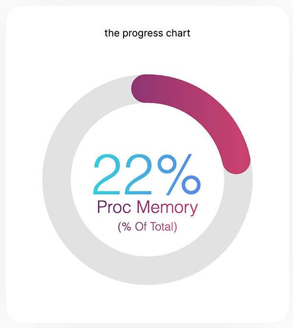

# Uncharted Phoenix
A simple ***Elixir*** charting library that generates easy to customize charts for ***Phoenix*** and ***LiveView***.

## Features
Easily generate pie charts, column charts, bar charts, progress counters, and line charts
Generates responsive and accessible SVGs as LiveView components
Provides advanced styling like gradients and rounded corners
Smooth animations for updating live data to the UI

## HEX Installation
Add this to your mix.exs deps:
``` {:uncharted_phoenix, "~> 0.1.0"} ```

## How To Use

### The Column Chart


  ```
  column_chart = %BaseChart{
      title: "Cheese Coney Consumption by Neighborhood",
      colors: colors,
      dataset: %ColumnChart.Dataset{
        axes: %BaseAxes{
          magnitude_axis: %MagnitudeAxis{
            max: 10_000,
            min: 0
          }
        },
        data: Cincy.get()
      }
    }
  ```

### The Bar Chart

  ```
  defp bar_chart do
    memory_data = MemoryChart.get()

    data = MemoryChart.convert_to_datum(memory_data)

    %BaseChart{
      title: "Live Beam Memory Stats",
      colors: %{
        blue: "#36D1DC",
        rosy_gradient: %Gradient{
          start_color: "#642B73",
          stop_color: "#C6426E"
        }
      },
      dataset: %BarChart.Dataset{
        axes: %BaseAxes{
          magnitude_axis: %MagnitudeAxis{
            max: MemoryChart.chart_max(memory_data),
            min: 0
          }
        },
        data: data
      }
    }
  end
end
  ```

### The Pie Chart


 ```
 pie_chart = %BaseChart{
      title: "Best kind of pie",
      colors: %{
        rose_gradient: %Gradient{
          start_color: "#642B73",
          stop_color: "#C6426E"
        },
        blue_gradient: %Gradient{
          start_color: "#36D1DC",
          stop_color: "#5B86E5"
        },
        red_gradient: %Gradient{
          start_color: "#FF9486",
          stop_color: "#FF1379"
        }
      },
      dataset: %PieChart.Dataset{
        data: [
          %BaseDatum{
            name: "Pecan",
            fill_color: :red_gradient,
            values: [20.0]
          },
          %BaseDatum{
            name: "Blueberry",
            fill_color: :blue_gradient,
            values: [28.0]
          },
          %BaseDatum{
            name: "Pumpkin",
            fill_color: :rose_gradient,
            values: [35.0]
          },
          %BaseDatum{
            name: "Chocolate",
            fill_color: :blue_gradient,
            values: [17.0]
          }
        ]
      }
    }
 ```

### The Live Line Chart


 ```
 line_chart = %BaseChart{
      title: "Live Line Chart",
      colors: colors,
      dataset: %ColumnChart.Dataset{
        axes: %XYAxes{
          x: %MagnitudeAxis{
            max: 700,
            min: 0
          },
          y: %MagnitudeAxis{
            max: 2500,
            min: 0
          }
        },
        data: [
          %BaseDatum{
            name: "Point 1",
            fill_color: :blue_gradient,
            values: [70, 500]
          },
          %BaseDatum{
            name: "Point 2",
            fill_color: :blue_gradient,
            values: [150, 1000]
          },
          %BaseDatum{
            name: "Point 3",
            fill_color: :blue_gradient,
            values: [350, 1600]
          },
          %BaseDatum{
            name: "Point 4",
            fill_color: :blue_gradient,
            values: [450, 1500]
          },
          %BaseDatum{
            name: "Point 5",
            fill_color: :blue_gradient,
            values: [550, 2000]
          }
        ]
      }
    }
 ```

### The Progress Chart

```
defp progress_chart(from: %BaseChart{} = chart) do
    memory = Memory.get()

    %BaseChart{
      chart
      | title: "Process Memory / Total",
        colors: %{
          rose_gradient: %Gradient{
            start_color: "#642B73",
            stop_color: "#C6426E"
          },
          blue_gradient: %Gradient{
            start_color: "#36D1DC",
            stop_color: "#5B86E5"
          },
          red_gradient: %Gradient{
            start_color: "#FF9486",
            stop_color: "#FF1379"
          },
          gray: "#e2e2e2"
        },
        dataset: %ProgressChart.Dataset{
          background_stroke_color: :gray,
          label: "Proc Memory",
          secondary_label: "(% Of Total)",
          to_value: memory.total,
          current_value: memory.process,
          percentage_text_fill_color: :blue_gradient,
          percentage_fill_color: :rose_gradient,
          label_fill_color: :rose_gradient
        }
    }
  end
```

### Base Chart Colors
Base chart configuration allows you to define set solid colors and gradients for any chart you will use within the application.

#### Set a Base Color
```
colors = %{
  blue: "#6bdee4",
}
```

#### Set a Base Gradient Color
```
colors = %{
  rose_gradient: %Gradient{
    start_color: "#642B73",
    stop_color: "#C6426E"
  }
}
```
